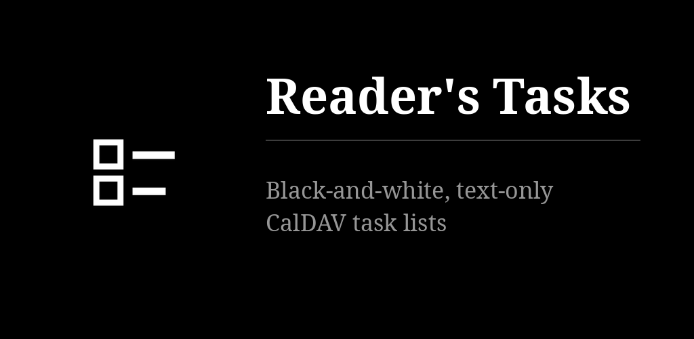

# Reader's Tasks for Android

The open tasks of your CalDAV lists (Infomaniak, Nextcloud, Tasks.org Cloud, Radicale…) as
plain text. Tick to complete, one line to add, long press for the rest. No priorities, no
projects, no account with the app: your server, your password, on the phone only. Android twin
of the desktop [Reader's Tasks](https://github.com/funkypitt/readers-tasks).

## Key points

* One screen: the open tasks of the current list. ☐ completes, the line at the bottom adds,
  long press renames, sets "due tomorrow" or deletes. "show n done" reveals completed tasks; ☑ reopens one.
* Tap the list name at the top to switch list. Lists can be hidden and reordered (long press).
* Long press a task, then drag it: the order is saved on the server (X-APPLE-SORT-ORDER), so
  the desktop app shows the same order.
* Account: settings → account: server, username, app password. Infomaniak:
  `https://sync.infomaniak.com`, username like `AB12345`, an application password with two-factor on.
* The network is used for your CalDAV server only. Credentials export and import as a JSON
  file shared with the desktop apps.
* Feeds the tasks tile of [Reader's Launcher](https://github.com/funkypitt/readers-launcher)
  through a signature-protected provider: no permission prompt, both apps carry the same key.
* Two home-screen widgets for any launcher: the first open task, or the open tasks as a list.
  Ticking completes on the server; + opens the new-task prompt.
* White on black or black on white, serif / sans / mono, three sizes. Six languages.

## Install


[](https://gallaz.ch/eink/#readers-tasks-android)

- **F-Droid** (recommended, updates arrive by themselves): add the repository from [gallaz.ch/eink](https://gallaz.ch/eink/#fdroid), or the address `https://funkypitt.github.io/fdroid-repo/repo` in F-Droid.
- **Obtainium**: tap the badge on the phone, or add `https://github.com/funkypitt/readers-tasks-android` in Obtainium.
- **APK**: attached to the [latest release](../../releases/latest). No automatic updates.

All three deliver the same file, with the same signature.

## Build

```
./gradlew assembleDebug
```

Kotlin, Jetpack Compose (foundation only), kotlinx-serialization for the cache file. The
CalDAV part is four HTTP requests (PROPFIND, REPORT, PUT, DELETE) over HttpURLConnection —
no library. MIT.

## Crédits / Credits

© 2026 Pierre Gallaz. Développé avec [Claude Code](https://claude.com/claude-code) (Anthropic).
Licence MIT, voir `LICENSE`.

© 2026 Pierre Gallaz. Developed with [Claude Code](https://claude.com/claude-code) (Anthropic).
MIT licence, see `LICENSE`.
